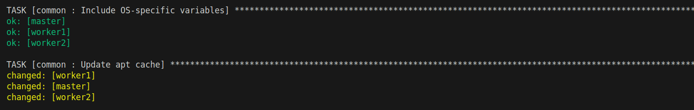
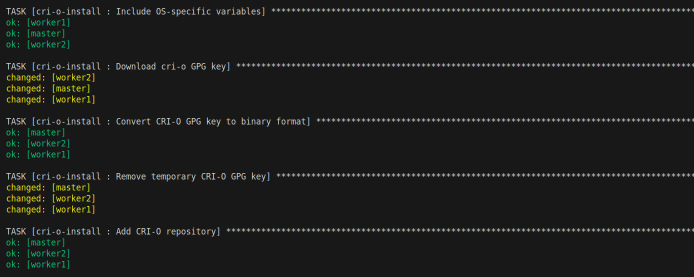
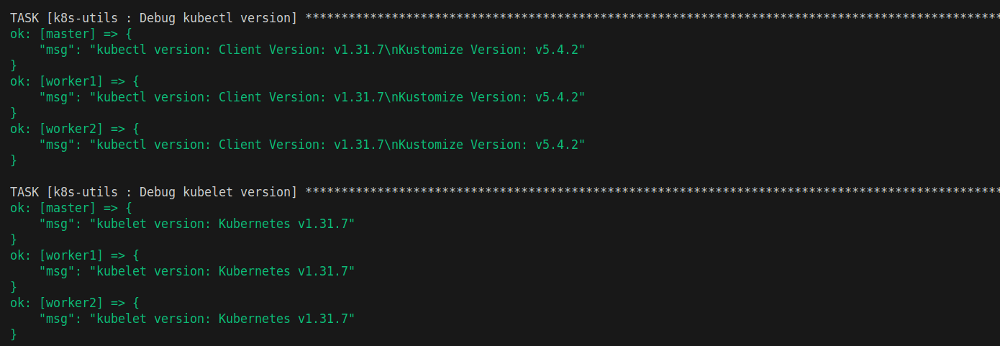
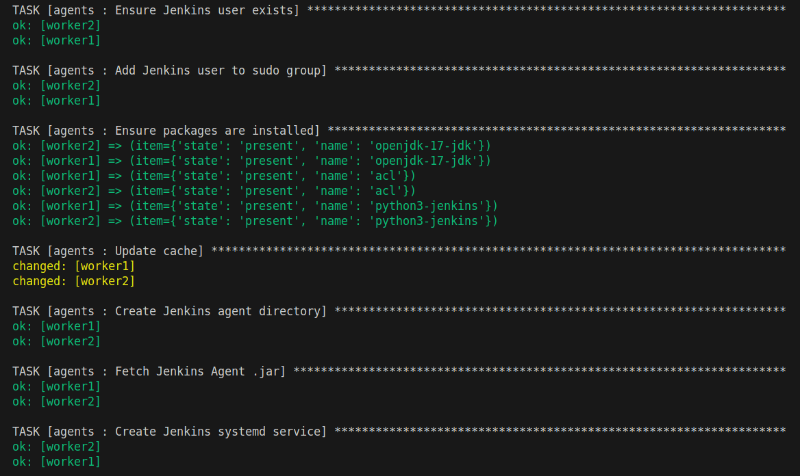
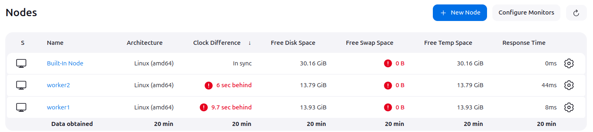
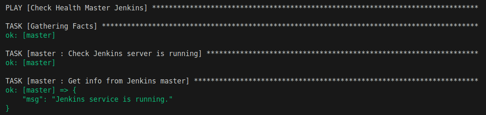

## Ansible.by.D.Livesey


---
 Еще есть вторая часть приключений [ТЫК](https://gitlab-pub.yadro.com/devops/2025/n.bakhilin/ansible-automation)
---
### Requirements
---
Ubuntu 22

---
 
### Run playbook

Плейбуки находятся тут `playbooks/production/`

#### Выполнить полную конфигурацию.
```bash
$ ansible-playbook playbook.yml --vault-pass-file vault_pass.yml
```
`vault_pass.txt` - файл с паролем для `ansible-vault`

---

## Overview
1. [Introduction](#introduction)
2. [Roles](#roles)
   - [common](#common)
   - [cri-o-install](#cri-o-install)
   - [k8s-utils](#k8s-utils)
   - [agents](#agents)
   - [master](#master)
3. [Playbooks.production](#playbooks)
   - [prepare_nodes.yml](#prepare_nodes)
   - [agents.yml](#agents)
4. [part 2](https://gitlab-pub.yadro.com/devops/2025/n.bakhilin/ansible-automation)

---

## Introduction

### Cтруктура

```yml
/inventory/production/group_vars/
  nodes.yml
/inventory/production/host_vars/
  master.yml
  worker1.yml
  worker2.yml
/playbooks/production/
  agents.yml
  install_cri_o.yml
  install_k8s_utls.yml
  prepare_nodes.yml
roles/
  agents/
  common/
  cri-o-install/
  k8s-utils/
  master/
secrets.yml
ansible.cfg
```
## Vars
Основные переменные для каждой роли описаны в соответствующих разделах. Переменные могут быть переопределены в:
- `group_vars/` — для групп хостов.
- `host_vars/` — для отдельных хостов.
- `defaults/main.yml` — в каждой роли.


### Доступные узлы 

```yml
agents:
  hosts: 
    worker1:
    worker2: 
      
master:
  hosts:
    master:

nodes:
  children: 
    master:
    agents:

```
---

## Roles

### common
Установка основных пакетов на все узлы будущего кластера.


**Tasks:**
- Определения целевой ОС
- Установка пакетов. 
- Добавление репозитория Kubernetes. 

**Vars:**
- `_apt`: Список пакетов для установки.
- `kubic_apt_gpg_key`: URL GPG-ключа для репозитория Kubernetes.
- `kubic_apt_repository`: Строка репозитория Kubernetes.



---

### cri-o-install
Установка CRI-O на узлы. 

**Основные задачи:**
- Скачивание GPG ключа, для подтверждения репозитория.
- Установка CRI-O.

**Переменные:**
- `cri_o_version`: Версия CRI-O.
- `cri_o_conf_path`: Путь к конфигурационному файлу CRI-O.



---

### k8s-utils
Роль для установки утилит Kubernetes.

**Основные задачи:**
- Установка `kubectl`, `kubeadm`, `kubelet`.
- Проверка установки утилит.

**Переменные:**
- `kubectl_version`: 
- `kubeadm_version`: 
- `kubelet_version`: 



---

### agents
Роль для настройки и запуска Jenkins агентов.

**Основные задачи:**
1. Установка apt пакетов для будущего кластера.
2. Скачивание agent.jar с мастер узла. 
3. Создание systemd сервиса для jenkins агента.
4. Запуск jenkins юнита.

Был задействован шаблонизатор j2 чтобы создать службу для agent.jar. `templates/`

**Переменные:**
- `jenkins_url`: URL Jenkins сервера.
- `jenkins_age
- `jenkins_agent_secret`: Секрет агента сгенерированный на built-in узле.
- `jenkins_work_dir`: Рабочая директория агента.




### Подключенные агенты


---

### master
Проверяем доступность Jenkins мастера.


---

## Playbooks

1. `install_cri_o.yml` - Проверяет, есть ли пакеты cri-o на хосте и если нет – установляет их.
2. `install_k8s_utils.yml` - Проверяет, есть ли пакеты k8s на хосте и если нет – установляет их.
3. `prepare_nodes.yml` - 1 и 2 плейбуки.
4. `agents.yml` - Проверяет, есть ли agent.jar и установлено ли соединение, если нет – установляет и соединяет. 
5. `playbook.yml` - 3 и 4 плейбуки.

для хранения секретов jenkins-а используем `ansible-vault`

`--vault-pass-file vault_pass.txt`

### install_cri_o.yml

```yaml
---

- name: Install cri-o
  hosts: nodes
  vars_files:
    - "{{ playbook_dir }}/../../secrets.yml"

  roles:
    - role: common
    - role: cri-o-install
```

**Использование:**
```bash
$ ansible-playbook playbooks/production/install_cri_o.yml --vault-password-file=vault_pass.txt
```


### install_k8s_utils.yml

```yaml
---

- name: Install k8s utils
  hosts: nodes
  vars_files:
    - "{{ playbook_dir }}/../../secrets.yml"
  roles:
    - role: common
    - role: k8s-utils
```

**Использование:**
```bash
$ ansible-playbook playbooks/production/install_k8s_utils.yml --vault-password-file=vault_pass.txt

```

### prepare_nodes
Настраиваем инфраструктуру, устанавливаем CRI-O и Kubernetes компоненты на все узлы будущего кластера.


**Основные задачи:**
1. Установка общих зависимостей (`common`).
2. Установка CRI-O (`cri-o-install`).
3. Установка компонентов k8s. (`k8s-utils`)

```yaml
---

- name: Prepare nodes for cluster k8s
  hosts: nodes
  become: true
  vars_files:
    - "{{ playbook_dir }}/../../secrets.yml"
  pre_tasks:
    - name: Update cache
      ansible.builtin.apt:
        update_cache: true
        cache_valid_time: 1800

  roles:
    - role: common
    - role: cri-o-install
    - role: k8s-utils
```

**Использование:**
```bash
$ ansible-playbook playbooks/production/prepare_nodes.yml --vault-password-file=vault_pass.txt
```
---


### agents
для хранения секретов jenkins-а используем `ansible-vault`

**Основные задачи:**
1. Проверяем доступность master Jenkins.
2. Устанавливаем agents на рабочие ноды.
3. Подключение агентов к контроллеру.

```yaml
---
- name: Check Health Master Jenkins
  hosts: master
  vars_files:
    - "{{ playbook_dir }}/../../secrets.yml"
  roles:
    - role: master

- name: Connect Agents to Master Jenkins
  hosts: agents 
  become: true
  vars_files:
    - "{{ playbook_dir }}/../../secrets.yml"
  roles:
    - role: agents

```

**Использование:**
```bash
$ ansible-playbook playbooks/production/agents.yml --vault-password-file=vault_pass.txt
```
---

### Problems
