# Jenkins Multibranch Pipeline Documentation

<p align="center">
    
</p>


Данная автоматизация была создана для проекта по предоставлению информации по курсу валют. `currency-rest-api`

## Оглавление
1. [Introduction](#overview)
2. [Pipeline Stages](#pipeline-stages)
   - [CLONE](#clone)
   - [LINT ](#lint)
   - [BUILD](#build)
   - [SCAN and LOGIN](#scan-and-login)
   - [DEPLOY and DELETE](#deploy-and-delete)
3. [Shared Library](#shared-library)
4. [Statuses](#статусы-сборок)


---

## Introduction
Был создан проект Multibranch Pipeline для автоматизации сборки и деплоя проекта на публичный реестр Докера. Для написания `Jenkinsfile` был использован `scripted pipeline` стиль. Добавлено параллельное выполнение некоторых этапов. 

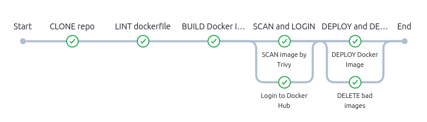

---
Запуск pipeline и сборка происходит на `built-in` узле.(Master)
```groovy
@Library('jenkins-shared-library') _
import org.currency.DockerUtils

node('built-in'){
    try {
         if (env.BRANCH_NAME == 'master' || env.BRANCH_NAME.startsWith('n.bakhilin')) {
            def dockerUsername = 'bakhilin'
            def dockerImageTag = '0.1.1'
            def dockerImageName = "${dockerUsername}/currency-rest-api"
            def buildSuccess = true
            def dockerUtils = new DockerUtils(this)

            //stages
        }
    } catch(err) {
        echo "Caught: ${err}"
    } finally {
        pipeline_utils.logBuildInfo()
    }
}
```
---

## Pipeline Stages

### CLONE
- **Описание**: Клонирование репозитория.
- **Shared Library**: [errorHandler(String stageName)](#errorhandler)
- **Код**:
  ```groovy
  stage('CLONE repo') {
      buildSuccess = pipeline_utils.errorHandler(STAGE_NAME){
          checkout scm
      }
  }
  ```
- **Результат**:  
  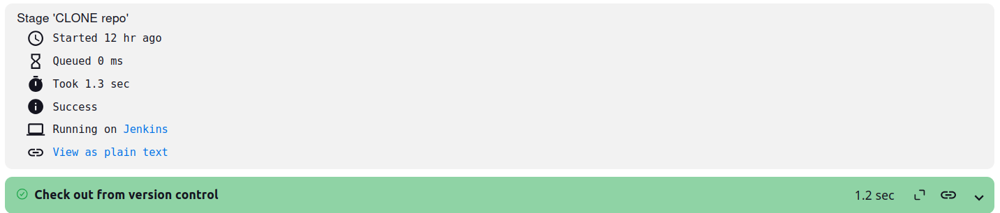
  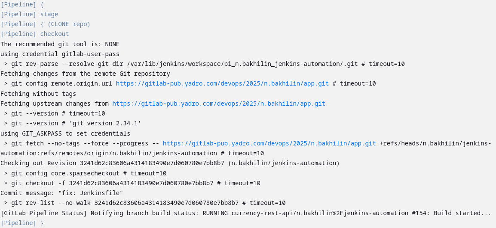

---

### LINT 
- **Описание**: Линтер `hadolint` для Dockerfile. 
- **Shared Library**: [lint(tring linter, String tag, String flags, String command)](#lint-1)
- **Код**:
  ```groovy
    stage('LINT dockerfile') {
        def linter = 'hadolint/hadolint'
        def tag = 'latest'
        def flags = ''
        def command = '< Dockerfile'
        pipeline_utils.lint(linter, tag, flags, command)
    }
  ```
- **Результат**:  
  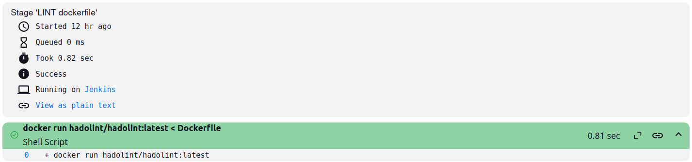
  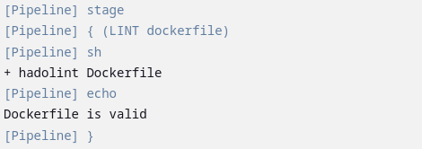

---

### BUILD 
- **Описание**: Сборка докер образа из Dockerfile.
- **Shared Library**: [errorHandler(String stageName)](#errorhandler) [dockerUtils](#dockerutils)
- **Код**:
  ```groovy
  stage('BUILD Docker Image') {
      if (buildSuccess) {
          buildSuccess = pipeline_utils.errorHandler(STAGE_NAME){
              dockerUtils.buildImage(dockerImageName, dockerImageTag)
          }
      }
  }
  ```
- **Результат**:  
    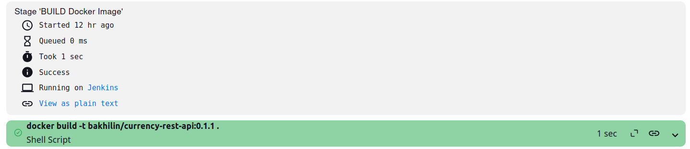
    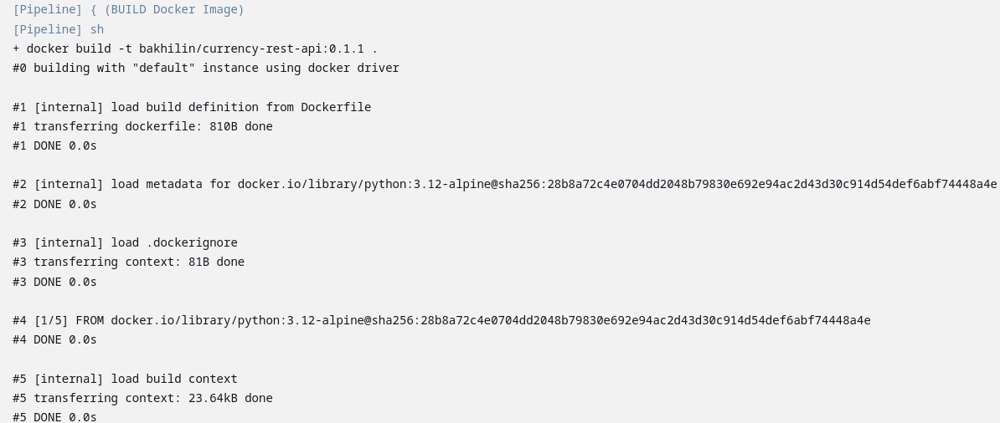
---

### SCAN and LOGIN - Parallel Stages
- **Описание**: 
  - **SCAN image by Trivy**: Поиск уязвимостей в собранном образе (сделать информативный этап, без учета ошибок).
  - **Login to Docker Hub**: Логин в DockerHub по установленным секретам (credentials)Jenkins.
- **Shared Library**: [errorHandler(String stageName)](#errorhandler) [dockerUtils](#dockerutils)
- **Код**:
  ```groovy
  stage('SCAN and LOGIN') {
      parallel(
          'SCAN image by Trivy': {
              dockerUtils.scanImageTrivy(dockerImageName, dockerImageTag)
          }, 
          'Login to Docker Hub': {
              if (buildSuccess) {
                  buildSuccess = pipeline_utils.errorHandler(STAGE_NAME) {
                      dockerUtils.loginToDockerHub('docker-hub-credentials')
                  }
              }
          }
      )
  }
  ```
- **Результат**:  
  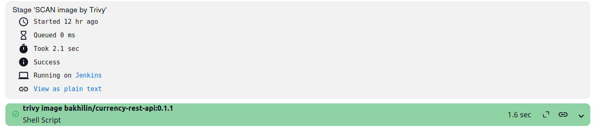
  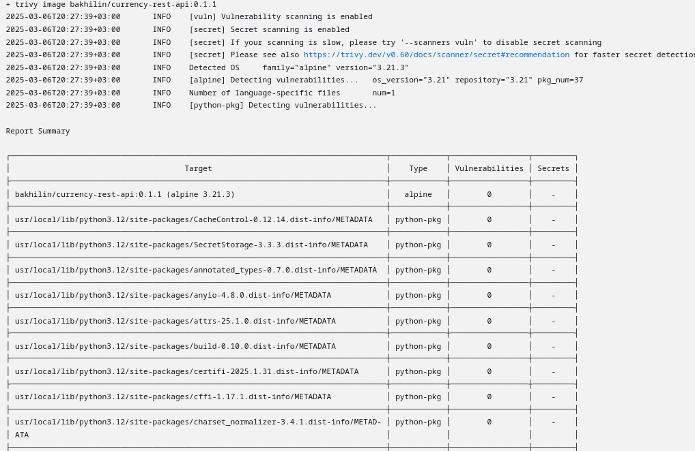
  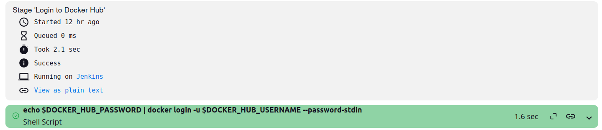
  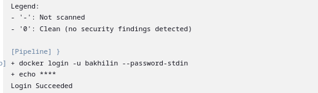
---

### DEPLOY and DELETE - Parallel Stages
- **Описание**:
  - **DEPLOY Docker Image**: Публикация образа в реестр.
  - **DELETE bad images**: Удаление не нужных образов на виртуальной машине.
- **Shared Library**: [errorHandler(String stageName)](#errorhandler) [dockerUtils](#dockerutils)
- **Код**:
  ```groovy
  stage('DEPLOY and DELETE') {
      parallel(
          'DEPLOY Docker Image': {
              if (buildSuccess || currentBuild.result == null || currentBuild.result == 'SUCCESS') {
                  buildSuccess = pipeline_utils.errorHandler(STAGE_NAME) {
                      dockerUtils.pushImageDockerHub(dockerImageName, dockerImageTag)
                  }   
              }                        
          },
          'DELETE bad images': {
              pipeline_utils.errorHandler(STAGE_NAME){
                  dockerUtils.deleteImages()
              }
          }
      )
  }
  ```
- **Результат**:  
  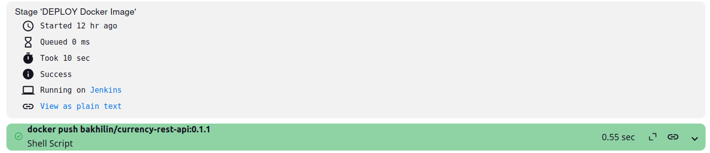
  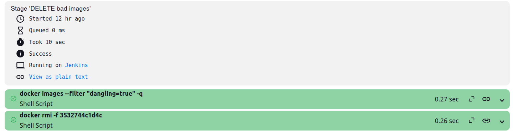
  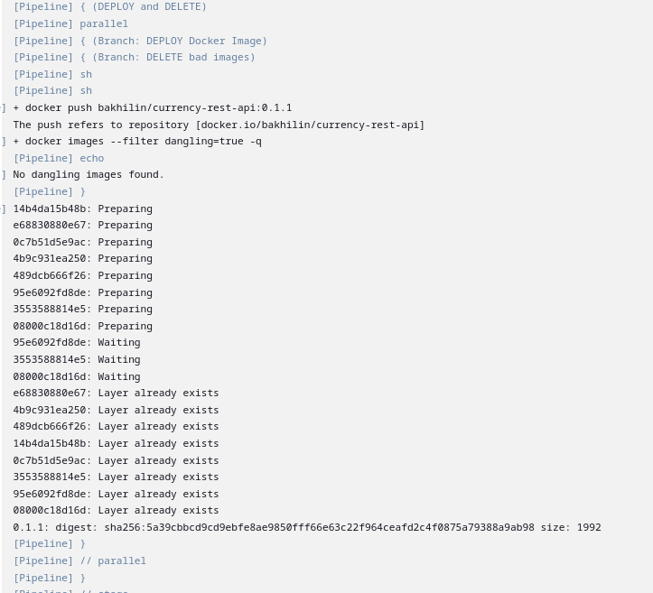

---

## Shared Library
Исходный код находится по адресу [код](https://gitlab-pub.yadro.com/devops/2025/k.oreshin/shared_libraries_group/shared_libraries/-/tree/n.bakhilin/jenkins-shared-library?ref_type=heads)


- **`DockerUtils`**: Выполнение операций Docker (build, scan, login, push, delete).
- **`pipeline_utils`**: Функции для обработки ошибок и логирования.


### DockerUtils 

```groovy
package org.currency

class DockerUtils implements Serializable {
    def steps

    DockerUtils(steps) {
        this.steps = steps
    }

    // Builds a Docker image
    void buildImage(String imageName, String tag) {
        steps.sh "docker build -t ${imageName}:${tag} ."
    }

    // Scans a Docker image using Trivy
    void scanImageTrivy(String imageName, String tag) {
        steps.sh "trivy image ${imageName}:${tag}"
    }

    // Logs into Docker Hub using credentials
    void loginToDockerHub(String credentialsId) {
        steps.withCredentials([steps.usernamePassword(
            credentialsId: credentialsId,
            passwordVariable: 'DOCKER_HUB_PASSWORD',
            usernameVariable: 'DOCKER_HUB_USERNAME'
        )]) {
            steps.sh '''
                echo $DOCKER_HUB_PASSWORD | docker login -u \
                    $DOCKER_HUB_USERNAME --password-stdin
            '''
        }
    }

    // Pushes a Docker image to Docker Hub
    void pushImageDockerHub(String imageName, String tag) {
        steps.sh "docker push ${imageName}:${tag}"
    }

    // Deletes Docker images
    void deleteImages() {
        def wasteImages = steps.sh(script: 'docker images --filter "dangling=true" -q', returnStdout: true).trim()
        if (wasteImages) {
            steps.sh "docker rmi -f ${wasteImages}"
        } else {
            steps.echo "No dangling images found."
        }
    }
}
```

#### Ключевые методы:
- **`buildImage`**: Собирает докер образ.
- **`scanImageTrivy`**: Сканирует докер образ на уязвимости и предоставляет информацию.
- **`loginToDockerHub`**: Логин в DockerHub.
- **`pushImageDockerHub`**: Публикация образа на публичный реестр.
- **`deleteImages`**: Удаление не нужных образов.


### Служебные функции


#### `errorHandler`
Блок перехвата и обработки ошибки при выполнении stage. Если ошибка произошла, устанавливается статус FAILURE. 

```groovy
def errorHandler(String stageName, Closure body) {
    try {
        body()
    } catch (err) {
        echo "Error in stage ${stageName} : ${err}"
        currentBuild.result = 'FAILURE'
        return false // buildSuccess flag
    }
    return true
}
```

#### `logBuildInfo`
Информация по сборке.

```groovy
def logBuildInfo() {
    echo """
        Build ID: ${env.BUILD_ID} \n
        Build Tag: ${env.BUILD_TAG} \n
        Workspace: ${env.WORKSPACE} \n
    """
}
```

#### `lint` 
Линтер для Dockerfile, можно выбрать. 
```groovy
void lint(String linter, String tag, String flags, String command) {
    int linterReturnCode = sh(script: "docker run ${flags} ${linter}:${tag} ${command}", returnStatus: true)
    if (linterReturnCode) {
        unstable(message: 'Lint error')
    }
}
```

---

## Статусы сборок
1. **Unstable build**:  
   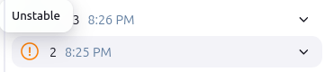

2. **Successful Build**:  
   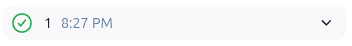

3. **Failed Build**:  
   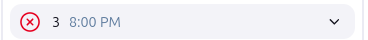

