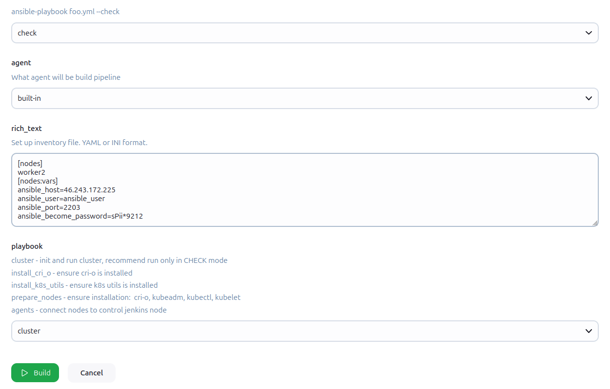

## Kubernetes.part1


## Overview
1. [Создаем кластер](#создание-кластера-и-добавление-cni-плагина-calico)
2. [CNI plugin Calico](#cni-plugin-calico)
3. [Устанавливаем namespace](#создаем-свой-namespace-bakhilin)
4. [Проверка доступности PING](#проверим-доступность-ping-8888-из-коробки)
5. [Плейбук](#ansible-playbook)
6. [Прогнать плейбук в Jenkins](#инструкция)
7. [Манифесты](#манифесты)


### Создание кластера и добавление CNI плагина Calico.

#### Создание control-plane ноды.
```bash
$ kubeadm init —pod-network-cidr 192.168.0.0/16
```

Как видим, все сервисы доступны. 


### Подключение `worker` нод к `control-plane`.

```bash
$ kubeadm join 10.0.0.2:6443 --token token_name \
    --discovery-token-ca-cert-hash token_sha256
```

```bash
$ kubectl cluster-info
```

#### Проверяем доступность узлов.
```bash
$ kubectl get nodes
```


Как видим, все узлы доступны и готовы к работе. 

### CNI plugin Calico

Скрипт для установки :
1. [Master Calico](./scripts/install-calico-master.sh) 
2. [Nodes Calico](./scripts/install-calico-plugin.sh)


**работает на сетевом уровне(L3) т.е. использует IP маршрутизацию**

#### Давайте посмотрим на запущенные pods Calico.

```bash
$ kubectl get pods -n kube-system | grep calico
```


Давайте разберемся, что это за поды?

`calico-kube-controllers-74b89bd455-jzmlt` - контроллер управления политиками и состоянием Calico.

`calico-node-*****` - Агенты Calico, работающие на каждом узле кластера.

#### Вид маршрутизации в кластере

IPPool - это объект Calico, который определяет диапазон IP-адресов, выделяемых для подов, выдача уникальных IP адресов каждому поду, настройка маршрутизации между узлами. 

```bash
$ kubectl get ippools.crd.projectcalico.org -o yaml
```


`ipipMode: Always` - трафик между узлами инкапсулируется в  IP-in-IP (используется интерфейс tunl0). 

#### Давайте проверим так ли это. 
`ssh -p port root@46.243.172.225`

```bash
$ ip route | grep tunl0
```


Из вывода Таблицы маршрутизации видим, что используется 2 маршрута, это 2 нашиx worker ноды. 

`192.168.123.128/26` - Диапазон  IP адресов. `192.168.123.129 – 192.168.123.190`

`10.0.0.4` - IP адрес узла в сети. 

`onlink` - Флаг, разрешает отправку пакетов даже без L2 access. (MAC level)

##### ip

10.0.0.* - связь между узлами.

192.168.*.* - связь между подами

#### И давайте убедимся, что такой сетевой интерфейс действительно существует на другой ноде. 


### Создаем свой namespace. `bakhilin`

```bash
$ kubectl create namespace bakhilin
```
Либо
```bash
$ kubectl apply -f namespaces/namespace-dev.yml
```

#### Устанавливаем контекст по дефолту свой namespace.
```bash
$ kubectl config set-context --current --namespace=bakhilin
```


Установил базовую политику для подов. `baseline-bakhilin.yml`

```yaml
apiVersion: v1 
kind: Namespace
metadata:
  name: bakhilin
  labels:
    pod-security.kubernetes.io/enforce: baseline
    pod-security.kubernetes.io/enforce-version: v1.31
```

```bash
$ kubectl apply -f policy/baseline-bakhilin.yml
```

Проверим, что действительно работает.
```bash
kubectl get namespace bakhilin  --show-labels
```


### Проверим доступность ping 8.8.8.8 из коробки.

```bash
$ kubectl run -it --tty test --image=busybox -- sh
```


[Проблема с которой я столкнулся + Решение](https://telegra.ph/ping-permission-denied-are-you-root-03-19)

## Ansible playbook
`cluster.yml` [ТЫК](../ansible/playbooks/production/cluster.yml)

```bash
---
- name: Init cluster k8s
  hosts: nodes
  vars_files:
    - "{{ playbook_dir }}/../../secrets.yml"
  roles:
    - role: init-cluster
    - role: calico-cni-plugin

- name: Check NET_RAW capabilities
  hosts: agents
  vars_files:
    - "{{ playbook_dir }}/../../secrets.yml"
  roles:
    - role: check-net-raw
```

Включает в себя 3 роли:

* `init cluster` - создание кластера, `control-plane` [ТЫК](../ansible/roles/init-cluster/)
* `calico-cni-plugin` - установка CNI плагина на узлы [ТЫК](../ansible/roles/calico-cni-plugin/)
* `check-net-raw` - проверка capability NET_RAW [ТЫК](../ansible/roles/check-net-raw/)


```bash
$ cd ansible && ansible-playbook --check playbooks/production/cluster.yml --vault-pass-file vault_pass.txt
```


### Инструкция: 

+ Был добавлен в ansible_automation_in_docker пайплайн на Jenkins возможность прогона нового плейбука. `cluster.yml`

Ссылка на пайплайн: http://46.243.172.225:8081/job/ansible_automation_in_docker/

Кнопка **Build with Parameters**



#### Creds для прогона(теста):

Можно зайти проверить плейбук. 

Логин: `teacher` 

Пароль: `ryrrbfPCOZCI752422`

## Манифесты

### Service

#### python
```yml
apiVersion: v1 
kind: Service
metadata:
  name: python
  labels:
    app: python
spec:
  ports:
  - port: #
    targetPort: #
  selector:
    app: python
  type: #
```
#### redis
```yml
apiVersion: v1 
kind: Service
metadata: 
  name: redis
  labels: 
    app: redis
spec:
  ports: 
  - port: 6379
    targetPort: 6379
  selector: 
    app: redis
  type: ClusterIP
```
---

### Policy

#### network policy

Настройка сетевой политик для redis хранилища.

```yml
apiVersion: networking.k8s.io/v1
kind: NetworkPolicy
metadata: 
  name: allow-python-to-redis
  namespace: bakhilin
spec: 
  podSelector:
    matchLabels:
      app: redis
    policyTypes:
      - Ingress
    ingress:
      - from:
          - podSelector:
              matchLabels:
                app: python
        ports:
          - protocol: TCP
            port: 6379
```

baseline
```yml
apiVersion: v1 
kind: Namespace
metadata:
  name: bakhilin
  labels:
    pod-security.kubernetes.io/enforce: baseline
    pod-security.kubernetes.io/enforce-version: v1.31
```
limit
```yml
apiVersion: v1
kind: LimitRange
metadata:
  name: pod-limits
  namespace: bakhilin
spec:
  limits:
  - type: Pod
    max:
      cpu: "400m"
      memory: "512Mi"
    min:
      cpu: "150m"
      memory: "200Mi"
    defaultRequest:
      cpu: "200m"
      memory: "256Mi"
```

Quota
```yml
apiVersion: v1
kind: ResourceQuota
metadata:
  name: quota-pods
  namespace: bakhilin
spec:
  hard:
    pods: "5" 
```
---

### Controllers

#### Deployment 

#### python
```yml
apiVersion: apps/v1
kind: Deployment
metadata:
  name: python
  labels:
    app: python
spec:
  replicas: 2
  selector:
    matchLabels:
      app: python
  template:
    metadata:
      labels:
        app: python
    spec:
      containers:
      - name: #
        image: #
        ports:
        - containerPort: #
```

#### redis
```yml
apiVersion: apps/v1
kind: Deployment
metadata:
  name: redis
  labels:
    app: redis
spec:
  replicas: 1
  selector:
    matchLabels:
      app: redis
  template:
    metadata:
      labels:
        app: redis
    spec:
      containers:
      - name: redis
        image: #
        ports:
        - containerPort: 6379
```
#### busybox
```yml
apiVersion: apps/v1
kind: Deployment
metadata:
  name: busybox-deployment
  namespace: bakhilin
  labels:
    app: busybox
spec:
  replicas: 2
  selector: 
    matchLabels:
      app: busybox
  template:
    metadata:
      labels:
        app: busybox
    spec:
      containers:
      - name: busybox
        image: busybox:1.28
        command: ["sleep", "3600"]
```

### ReplicaSet
```yml
apiVersion: apps/v1
kind: ReplicaSet
metadata:
  name: busybox
  labels:
    app: busybox
spec:
  replicas: 2
  selector:
    matchLabels:
      app: busybox
  template:
    metadata:
      labels:
        app: busybox
    spec:
      containers:
      - name: busybox
        image: busybox:1.28
```
---

### Pods
busybox
```yml
apiVersion: v1 
kind: Pod
metadata: 
  name: busybox
spec: 
  containers:
  - name: busybox
    image: busybox:1.28
    resources:
      limits:
        memory: "256Mi"
    command: ["sleep", "3600"]

```