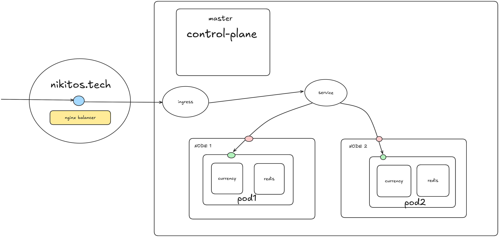
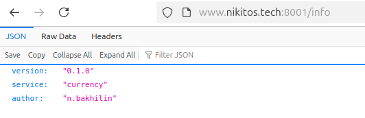
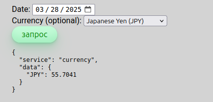
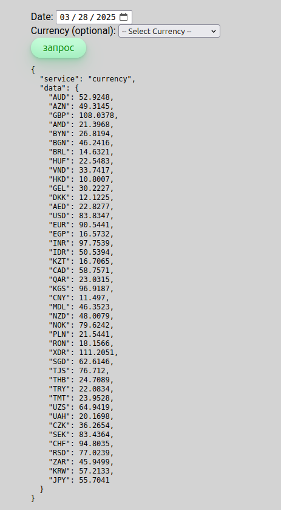
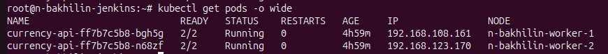
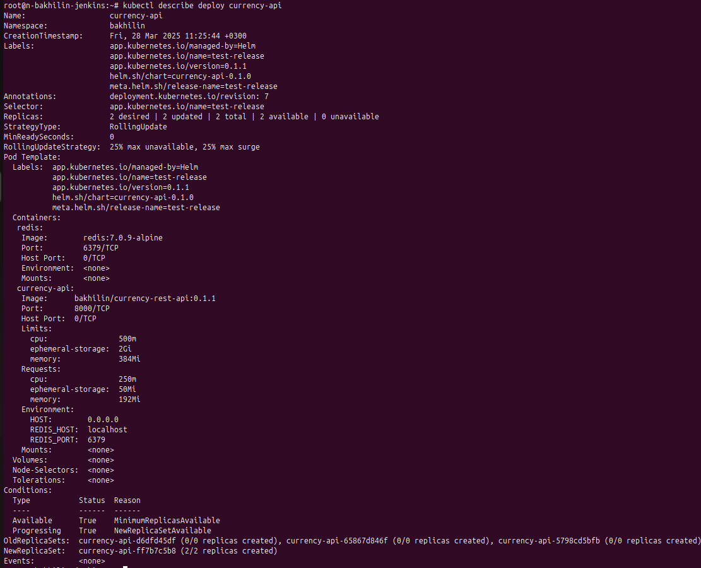
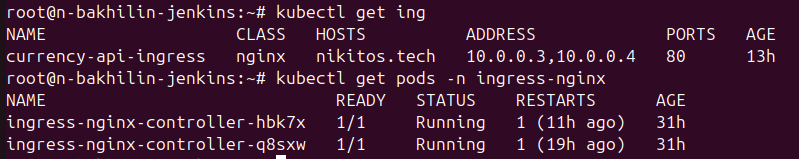

## Kubernetes.part2 | Deploy

### Архитектура кластера и организация сети.



## Overview
0. [Внешний балансировщик](#внешний-балансировщик-нагрузки-на-кластер)
1. [Обращение к ручкам сервиса](#обращение-к-ручкам-сервиса)
2. [Обеспечена отказоустойчивость](#обеспечена-отказоустойчивость)
3. [Ingress. Helm Charts](#ingress--helm-chart)
4. [Манифесты](#манифесты)


## Внешний балансировщик нагрузки на кластер.

Nginx, работает на удаленной машине в качестве внешнего балансировщика нагрузки.

#### Конфигурация
```conf
upstream k8s_ingress {
        least_conn;
        server 46.243.172.225:8002 max_fails=5 fail_timeout=20s;  # Worker 1
        server 46.243.172.225:8003 max_fails=5 fail_timeout=20s;  # Worker 2
        keepalive 100;
        keepalive_timeout 60s;
        keepalive_requests 1000;
    }

server {
	server_name nikitos.tech;
	
    proxy_set_header Host               $host;
    proxy_set_header X-Real-IP          $remote_addr;
    proxy_set_header X-Forwarded-For    $proxy_add_x_forwarded_for;
    proxy_set_header X-Forwarded-Proto  $scheme;
    proxy_http_version 1.1;

    location /info/currency {
	    proxy_pass http://k8s_ingress;
            proxy_connect_timeout 30s;
            proxy_read_timeout 60s;

    }

    location /info {
        proxy_pass http://k8s_ingress;
        proxy_connect_timeout 10s;
        proxy_read_timeout 20s;
    }
	location / {
		root /var/www/html/;
		try_files $uri $uri/ =404;
	}

    listen 443 ssl; # managed by Certbot
    listen [::]:443 ssl ipv6only=on; # managed by Certbot
    ssl_certificate /etc/letsencrypt/live/nikitos.tech/fullchain.pem; # managed by Certbot
    ssl_certificate_key /etc/letsencrypt/live/nikitos.tech/privkey.pem; # managed by Certbot
    include /etc/letsencrypt/options-ssl-nginx.conf; # managed by Certbot
    ssl_dhparam /etc/letsencrypt/ssl-dhparams.pem; # managed by Certbot

}

server {
    if ($host = nikitos.tech) {
        return 301 https://$host$request_uri;
    } # managed by Certbot


	listen 80 default_server;
	listen [::]:80 default_server;

	server_name nikitos.tech;
    return 404; # managed by Certbot


}

```

### Обращение к ручкам сервиса
Заходим на сайт и пользуемся сервисом! [CURRENCY API SERVICE](http://nikitos.tech)


https://nikitos.tech/
#### Примеры запросов

1. Выводим информацию о сервисе



2. Запрос определенной валюты



2. Запрос по дате



### Обеспечена отказоустойчивость

На каждой ноде в кластере крутится по одному поду. 





### Ingress | Helm Chart

#### Ingress 

```bash
NAME                   CLASS   HOSTS          ADDRESS             PORTS   AGE
currency-api-ingress   nginx   nikitos.tech   10.0.0.3,10.0.0.4   80      13h
root@n-bakhilin-jenkins:~# kubectl describe ing
Name:             currency-api-ingress
Labels:           app.kubernetes.io/managed-by=Helm
                  app.kubernetes.io/name=test-release
                  app.kubernetes.io/version=0.1.1
                  helm.sh/chart=currency-api-0.1.0
                  meta.helm.sh/release-name=test-release
Namespace:        bakhilin
Address:          10.0.0.3,10.0.0.4
Ingress Class:    nginx
Default backend:  <default>
Rules:
  Host          Path  Backends
  ----          ----  --------
  nikitos.tech  
                /info            currency-api:8000 (192.168.108.161:8000,192.168.123.170:8000)
                /info/currency   currency-api:8000 (192.168.108.161:8000,192.168.123.170:8000)
Annotations:    nginx.ingress.kubernetes.io/use-regex: true
Events:         <none>

```




#### Helm Chart 

За основу был взят Helm Chart Алексея Куценко -  Инженера по разработке ПО в YADRO.

### Манифесты

`deployment`

```yaml
---
# Source: currency-api/templates/ingress.yaml
apiVersion: v1
kind: Service
metadata:
  name: currency-api
  namespace: bakhilin
  labels:
    helm.sh/chart: currency-api-0.1.0
    app.kubernetes.io/version: "0.1.1"
    app.kubernetes.io/managed-by: Helm
    app.kubernetes.io/name: test-release
    meta.helm.sh/release-name: "test-release"
spec:
  ports:
    - name: http
      port: 8000
      protocol: TCP
      targetPort: 8000
  selector:
    app.kubernetes.io/name: test-release
  type: ClusterIP
status:
  loadBalancer: {}
---
# Source: currency-api/templates/deployment.yaml
apiVersion: apps/v1
kind: Deployment
metadata:
  name: currency-api
  namespace: bakhilin
  labels:
    helm.sh/chart: currency-api-0.1.0
    app.kubernetes.io/version: "0.1.1"
    app.kubernetes.io/managed-by: Helm
    app.kubernetes.io/name: test-release
    meta.helm.sh/release-name: "test-release"
spec:
  replicas: 2
  revisionHistoryLimit: 3
  strategy:
    type: RollingUpdate
    rollingUpdate:
      maxSurge: 25%
      maxUnavailable: 25%
  selector:
    matchLabels:
      app.kubernetes.io/name: test-release
  template:
    metadata:
      labels:
        helm.sh/chart: currency-api-0.1.0
        app.kubernetes.io/version: "0.1.1"
        app.kubernetes.io/managed-by: Helm
        app.kubernetes.io/name: test-release
        meta.helm.sh/release-name: "test-release"
    spec:
      containers:
        - name: redis
          image: "redis:7.0.9-alpine"
          imagePullPolicy: Always
          resources:
            limits:
              cpu: 500m
              ephemeral-storage: 2Gi
              memory: 384Mi
            requests:
              cpu: 250m
              ephemeral-storage: 50Mi
              memory: 192Mi
          ports: 
            - containerPort: 6379
        - name: currency-api
          image: "bakhilin/currency-rest-api:0.1.1"
          imagePullPolicy: Always
          resources:
            limits:
              cpu: 500m
              ephemeral-storage: 2Gi
              memory: 384Mi
            requests:
              cpu: 250m
              ephemeral-storage: 50Mi
              memory: 192Mi

          ports:
            - name: 8000-tcp
              containerPort: 8000
          env:
            - name: HOST
              value: 0.0.0.0
            - name: REDIS_HOST
              value: "localhost"
            - name: REDIS_PORT
              value: "6379"    
      dnsPolicy: ClusterFirst
      dnsConfig:
        nameservers:
          - 8.8.8.8
          - 77.88.8.8
```

`ingress`
```yaml
# Source: currency-api/templates/ingress.yaml
apiVersion: networking.k8s.io/v1
kind: Ingress
metadata:
  name: currency-api-ingress
  namespace: bakhilin
  labels:
    helm.sh/chart: currency-api-0.1.0
    app.kubernetes.io/version: "0.1.1"
    app.kubernetes.io/managed-by: Helm
    app.kubernetes.io/name: test-release
    meta.helm.sh/release-name: "test-release"
  annotations:
    nginx.ingress.kubernetes.io/use-regex: "true"
spec:
  ingressClassName: nginx
  rules:
    - host: "nikitos.tech"
      http:
        paths:
          - path: "/info"
            pathType: Prefix
            backend:
              service:
                name: currency-api
                port:
                  number: 8000
          - path: "/info/currency"
            pathType: Prefix
            backend: 
              service:
                name: currency-api
                port:
                  number: 8000  
```